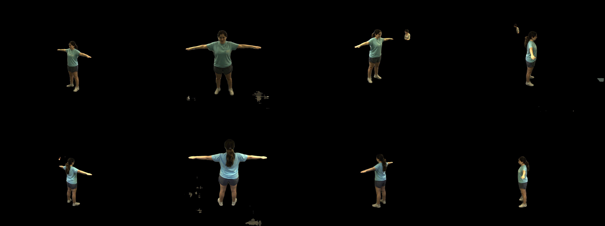
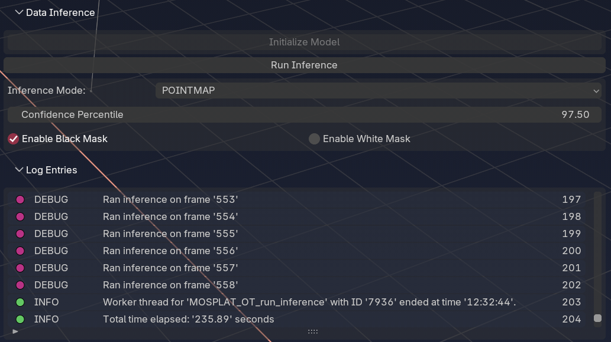

# 3D Gaussian Splatting for Motion Capture Data

This is a repository that was created with the intent of building a **gaussian splatting** pipeline for 3D Motion Capture data.

To elaborate, motion capture data is often exported from **sparse view directions**, say 4-8 cameras directed towards an area of focus. This differs from the usual creation process of gaussian splatting, which would be taken from a single, moving camera, and **Structure-from-Motion** techniques would use the continuous video data to interpolate the structure (as the concept's name connotates).

To circumvent this challenge, this project has achieved the following pipeline within a Blender add-on:

1. Given the path to a directory containing any form of video files (.mp4, .mov, .avi, etc.) that correspond to the same time frames taken from different views, video frames are extracted as PyTorch tensors and saved to disk as UInt8 data type (to reduce memory usage).


2. Provides a scripting API for user's to preprocess the video data for their specific camera setup. This includes per-camera / per-frame transformations.




This insertion into the pipeline is highly flexible and explained [in this file](mosplat_blender/bin/fix_mocap_camera_rotations.py).

3. Builds on Facebook's [VGGT](https://github.com/facebookresearch/vggt) model to convert image tensors to Stanford PLY format. After a refined inference step with scene parameter awareness, the following data is computed for the 3D scene:
    1. Continuous 3D data:
        1. 3D position point data
        2. RGB point data
        3. Point-map confidence values
        4. Depth-map confidence values
    2. Camera extrinsics
    3. Camera intrinsics
    4. A dense point cloud



## Requirements

- Blender 4.2+
- FFmpeg with shared library build
    - This project utilizes the new [torchcodec module](https://github.com/meta-pytorch/torchcodec), which requires installing FFmpeg with shared libraries. These are available cross-platform, but should be available before installing the add-on. More information can be found here in their [README](https://github.com/meta-pytorch/torchcodec?tab=readme-ov-file#installing-torchcodec)
- [NVIDIA CUDA Toolkit](https://developer.nvidia.com/cuda/toolkit) (for gaussian splat training)
    - To render video data

## Installation

### Pre-packaged Releases (CPU build)

Visit the [Releases](https://github.com/mialana/mocap-gsplat/releases) page of this repository, where ZIP files corresponding to Windows, Linux, and MacOS.

### From source (CUDA available)

```python
python ./scripts/build.py --cuda
```
