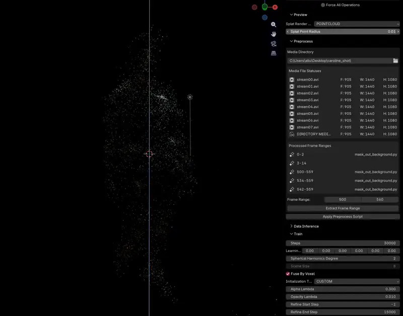
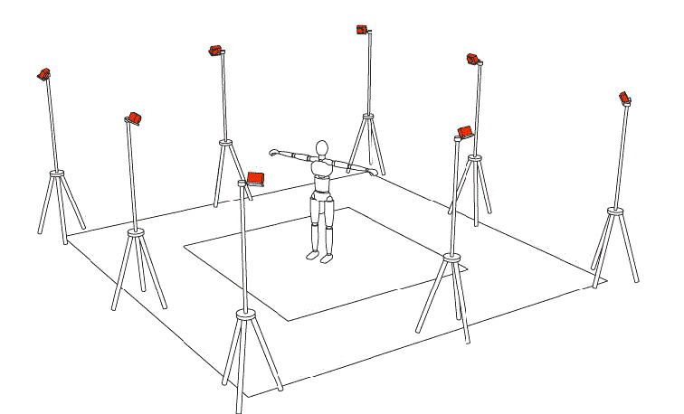
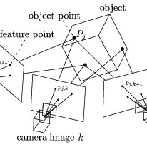
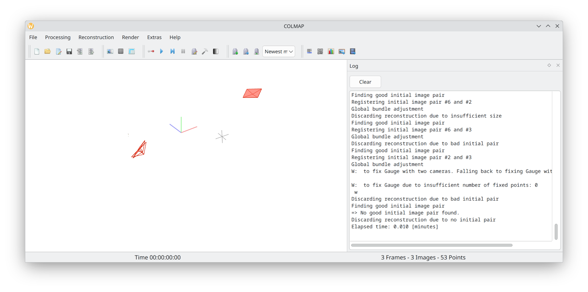
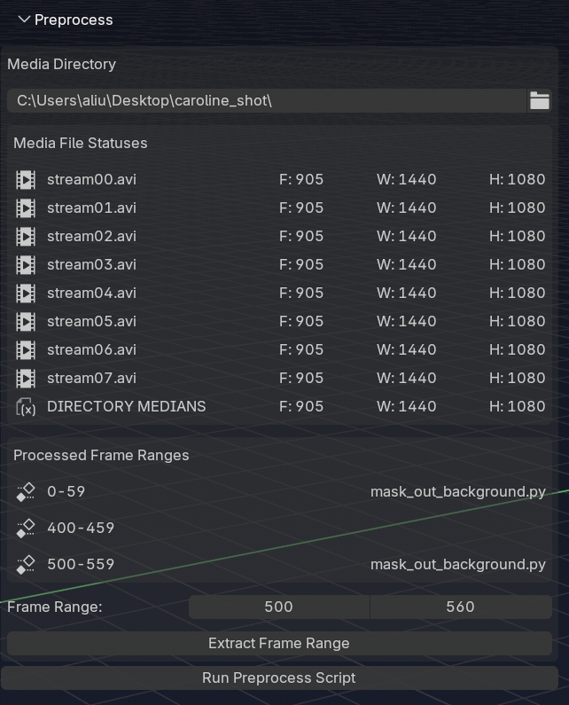
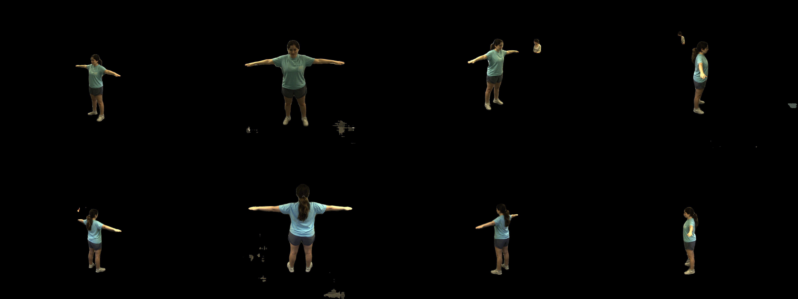
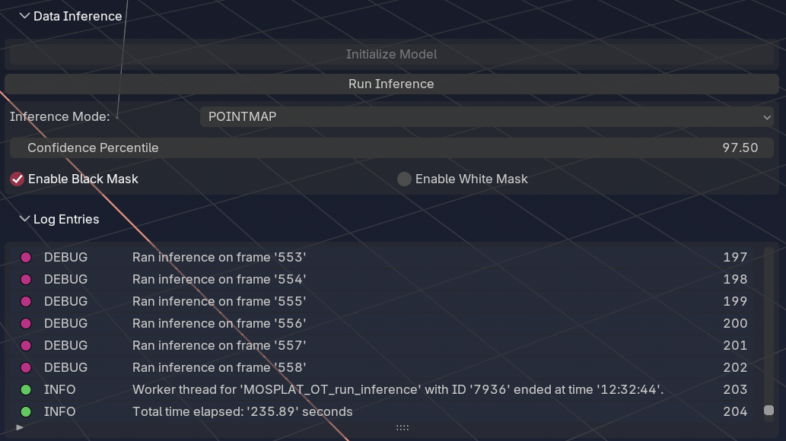
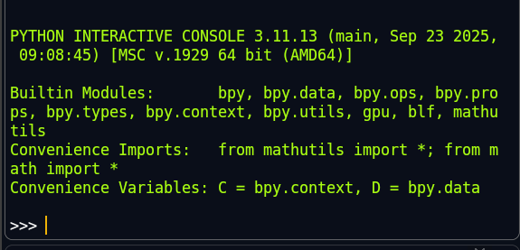
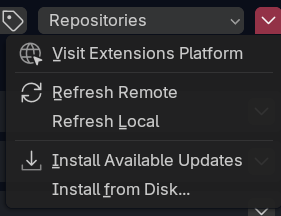

# (WIP) 3D Gaussian Splatting for Motion Capture Data in Blender



**Mocap Gsplat** (_Mo(tion)cap(ture) G(aussian)splat_) is a **Gaussian Splatting** pipeline for **3D Motion Capture** data packaged as a **Blender** Python add-on.

## Background & Motivation

Motion capture data is often exported from **sparse view directions**, say 4-8 cameras directed towards an area of focus.



This distinctly differs from the common source media used for gaussian splatting, which is taken from a single, moving camera, like so:


Then, **Structure-from-Motion** (SFM) techniques would be applied on that video data to generate a **dense point cloud** and predicted **camera extrinsics and intrinsics**. Notably, **SFM** relies on comparing frames within the input data to reconstruct the 3D structure of the scene / subject, extracting and matching **feature points** that are stable between many viewpoints.



So now, consider if you were to want to use **Motion Capture** videos as input to 3DGS. The obvious domain difference is in the lack of shared perspective between the different **sparse cameras**, subsequently, making SFM yield non-optimal results in feature point detection. In testing for this project, we found that SFM may often only be able to find less than **10 feature points** within the entire scene.



This is precisely the domain gap that is being tackled within this project.

## Current Achievements

1. Given the path to a directory containing any form of video files (.mp4, .mov, .avi, etc.) that correspond to the same time frames taken from different views, video frames are extracted as PyTorch tensors and saved to disk as UInt8 data type (to reduce memory usage).



2. Provides a scripting API for user's to preprocess the video data for their specific camera setup. This includes per-camera / per-frame transformations.




This insertion into the pipeline is highly flexible and explained [in this file](mosplat_blender/bin/fix_mocap_camera_rotations.py).

3. Builds on Facebook Research's [VGGT (Visual Geometry Grounded Transformer)](https://github.com/facebookresearch/vggt) Model to convert image tensors to Stanford PLY format. After a refined inference step with scene parameter awareness, the following data is computed for the 3D scene:
    1. Continuous 3D data:
        1. 3D position point data
        2. RGB point data
        3. Point-map confidence values
        4. Depth-map confidence values
    2. Camera extrinsics
    3. Camera intrinsics
    4. A dense point cloud



## Requirements

### Base Media Extraction and Point Cloud Generation:

- Blender 4.2+
- FFmpeg with shared library build
    - This project utilizes the new [torchcodec module](https://github.com/meta-pytorch/torchcodec), which requires installing FFmpeg with shared libraries. These are shipped cross-platform, but should be available on your system before registering the add-on in Blender. More information can be found here in their [README](https://github.com/meta-pytorch/torchcodec?tab=readme-ov-file#installing-torchcodec).

### Gaussian Splat Training

- [NVIDIA CUDA Toolkit](https://developer.nvidia.com/cuda/toolkit)
    - The 3DGS rasterization process occurs on custom GPU kernels from [Nerfstudio's Gsplat](https://github.com/nerfstudio-project/gsplat) library.

Note that this plugin is still functionable on system's where CUDA is not available (e.g. MacOS), but the `Train` panel will stay hidden and the corresponding `train_gaussian_splats_ot` operator will abort upon call.

## Installation

Firstly, please check what version of Python your Blender installation uses. Probably the easiest way to do this is to open Blender, navigate to the `Scripting` tab, and look at the `Python Console`, which should something like this:



### Pre-packaged Releases (NO CUDA, compatible-anywhere)

Visit the [Releases](https://github.com/mialana/mocap-gsplat/releases) page of this repository, where ZIP files corresponding to Windows, Linux, and MacOS are available, as well as variations per Blender Python versions. These ZIP files can directly be installed into Blender within user `Preferences`, and finding the 'Install from Disk' action (usually on top-right-hand of the popup window):



Just note that these releases will not support CUDA-dependent packages such as `gsplat`. This is simply due to size constraints in GitHub releases.

Installing with CUDA-enabled is almost just as easy though, and explained right below

### From source (CUDA available)

First, clone this repository and navigate to its root directory from any shell.

```bash
git clone git@github.com:mialana/mocap-gsplat.git
cd mocap-gsplat
```

If you use Python environments, you can activate one now with the same version as your Blender installation. Otherwise, you must run the following commands using an interpreter with the same version. You could technically use the interpreter that Blender ships with, but 'borrowing' an application's interpreter is usually not preferred in Python development.

```bash
python --version
Python 3.11.9 # this version needs to align with your Blender's Python interpreter!

# Optional
python -m venv .venv
# run the command to activate the environment depending on your OS
```

Install developer requirements:

```bash
python -m pip install -r requirements.txt
```

And lastly, run the command below:

```python
python ./scripts/build.py --cuda --blender-python-version=<your/blender/python/version/here> # `blender_python_version` syntax should be 3.11, 3.12, etc.
```

This script automates the download of runtime PyPI packages (as the CUDA-enabled versions) as Python wheels within the nested add-on directory, `mosplat_blender`. Then, it will package the add-on into a ZIP file, which can be moved anywhere and registered within Blender exactly like explained in the [Pre-packaged Releases](#pre-packaged-releases-no-cuda-compatible-anywhere) section.

Installation is complete!

## Credits

- [Facebook Research - `VGGT` (Visual Geometry Grounded Transformer) `Model`](https://github.com/facebookresearch/vggt)
- [Nerfstudio - `gsplat`](https://github.com/nerfstudio-project/gsplat)
